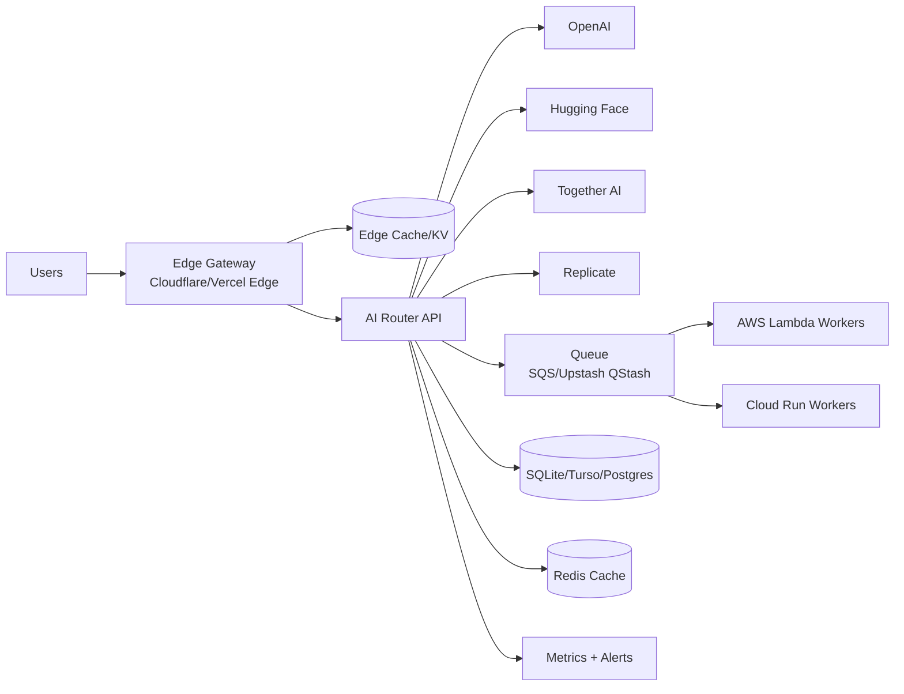

# Scalable Free-Tier AI: Production Architecture & Implementation Guide

A production-ready blueprint for building high-scale AI applications with near-zero cost by combining free-tier model providers, edge/serverless runtimes, aggressive caching, and smart routing.

This guide includes architecture diagrams, setup guides, cost and ROI modeling, deployment workflows, benchmark targets, and operational best practices.

## Reference implementation now included

This repository now includes a working TypeScript reference implementation:

- `src/router/*` multi-provider router with failover, health checks, provider + tenant rate limits, circuit breaker, and cost tracking
- `src/cache/*` Redis (Upstash-compatible) and SQLite edge cache with request fingerprinting, locking, TTL strategy, and invalidation
- `src/app.ts` task APIs for chat (SSE streaming), image queue handling, TTS batch, embeddings retrieval, webhook verification, idempotency, and tenant isolation
- `templates/*` serverless templates for Vercel, Cloudflare Workers, AWS Lambda, and Cloud Run
- `infra/docker/*` Docker and local compose orchestration
- `load-tests/*` k6 and Artillery scenarios for load, failover, and cache-stampede validation

Quick start:

```bash
cp .env.example .env
npm install
npm run migrate
npm run dev
```

---

## 1) Multi-Model AI Strategy

### Supported providers (free/low-cost friendly)
- **OpenAI** (free credits/trials when available)
- **Hugging Face Inference API**
- **Together AI**
- **Replicate**
- **Cloudflare Workers AI**
- **Groq / OpenRouter** (optional extensions)

### Routing principles
1. **Task-aware model selection** (chat vs. summarization vs. OCR vs. TTS).
2. **Cheapest acceptable model first**.
3. **Health-based failover** with circuit breakers.
4. **Latency-aware regional routing**.
5. **Quality fallback ladder** (small → medium → premium models).

### Router example (TypeScript)
```ts
// apps/api/src/router.ts
export type TaskType = 'chat' | 'summary' | 'classification' | 'image' | 'tts' | 'doc';

export interface Provider {
  name: string;
  supports: TaskType[];
  rpmLimit: number;
  avgLatencyMs: number;
  costWeight: number; // lower = preferred
  healthy: boolean;
  invoke: (payload: unknown) => Promise<unknown>;
}

export async function routeRequest(task: TaskType, providers: Provider[], payload: unknown) {
  const candidates = providers
    .filter(p => p.healthy && p.supports.includes(task))
    .sort((a, b) => (a.costWeight - b.costWeight) || (a.avgLatencyMs - b.avgLatencyMs));

  let lastError: unknown;
  for (const p of candidates) {
    try {
      return await p.invoke(payload);
    } catch (err) {
      lastError = err;
      // mark temporary unhealthy in shared cache/kv with short TTL
    }
  }
  throw new Error(`All providers failed for task=${task}: ${String(lastError)}`);
}
```

---

## 2) Serverless Infrastructure (Free Tier First)

### Core deployment map
- **Frontend + edge API gateway**: Vercel or Netlify
- **Low-latency edge middleware**: Cloudflare Workers
- **Burst compute / background jobs**: AWS Lambda
- **Containerized heavy workloads**: Google Cloud Run

### Free-tier capacity snapshot (typical)
- **AWS Lambda**: ~1M requests/month
- **Google Cloud Run**: generous request/runtime quotas
- **Cloudflare Workers**: ~100K requests/day (free plan baseline)
- **Vercel/Netlify**: hobby/free limits for frontend and serverless routes

> Always verify current quotas on provider pricing pages before launch.

### Reference architecture diagram (Mermaid)


---

## 3) Data & Caching Optimization

### Caching layers
1. **Edge cache** (Cloudflare Cache API / Vercel Edge cache)
2. **Redis cache** (Upstash/Redis Cloud free tiers)
3. **SQLite edge/local cache** (for dedupe + warm responses)

### Request deduplication key
`sha256(task + normalizedPrompt + modelPolicyVersion + tenantId)`

### Cache policy
- **Exact prompt cache**: TTL 5m–24h (task-dependent)
- **Semantic cache** (optional): vector similarity for near-match prompts
- **Negative cache**: short TTL for known provider failures

### Compression
- Enable **Brotli** first, **gzip** fallback.
- Compress JSON responses larger than ~1KB.

### Redis/SQLite pseudo-flow
```ts
const key = dedupeKey(payload);
const cached = await redis.get(key);
if (cached) return cached;

const lock = await redis.set(`lock:${key}`, '1', { nx: true, ex: 20 });
if (!lock) return await pollForCachedValue(key, 1500);

try {
  const result = await routeRequest(task, providers, payload);
  await redis.set(key, JSON.stringify(result), { ex: ttlByTask(task) });
  await sqliteCache.upsert(key, result);
  return result;
} finally {
  await redis.del(`lock:${key}`);
}
```

---

## 4) Edge Computing Strategy

### What runs at the edge
- Auth/session validation
- Rate limiting + abuse detection
- Prompt normalization
- Read-mostly cache lookups
- SSE stream fan-out for chat tokens

### Cloudflare Worker pattern
```ts
export default {
  async fetch(req: Request, env: Env): Promise<Response> {
    const cache = caches.default;
    const key = new Request(req.url, req);
    const cached = await cache.match(key);
    if (cached) return cached;

    const upstream = await fetch(env.ROUTER_URL, req);
    const resp = new Response(upstream.body, upstream);
    resp.headers.set('Cache-Control', 'public, max-age=60');
    await cache.put(key, resp.clone());
    return resp;
  }
};
```

---

## 5) Cost Management & Quota Control

### Controls to implement
- **Per-user / per-IP token buckets**
- **Daily/monthly hard quotas**
- **Batching** for embeddings/classification
- **Adaptive model selection**:
  - default: small model
  - escalate only when quality score is low
- **Budget circuit breaker**: degrade features before blocking all traffic

### Cost dashboard metrics
- Requests per provider/day
- Tokens in/out per provider/day
- Cache hit ratio (edge + redis)
- Fallback rate
- Error rate + p95 latency
- Estimated monthly cost vs. free-tier ceilings

---

## 6) Scalability Patterns

### Concurrency and async handling
- Use async I/O everywhere (`Promise.allSettled` for fan-out)
- Keep API routes stateless
- Queue heavy operations (image generation, long document processing)

### Queue options
- **BullMQ + Redis** (Node stack)
- **Celery + Redis/RabbitMQ** (Python stack)
- **Cloud-native**: SQS + Lambda / PubSub + Cloud Run

### Webhook callback pattern
1. API accepts job and returns `jobId`.
2. Worker processes asynchronously.
3. Worker calls client webhook (signed HMAC) on completion.
4. Client verifies signature and updates state.

### DB pooling
- Prefer serverless-friendly drivers/proxies (Neon/Vercel Postgres poolers, Prisma Data Proxy).
- Keep SQLite for edge read-through cache, not central write bottleneck.

---

## 7) Example Implementations (Working Patterns)

### A) Chat app with multi-model fallback
```ts
// POST /api/chat
const response = await routeRequest('chat', providers, {
  messages,
  stream: true,
  maxTokens: 512
});
return streamSSE(response);
```

Fallback ladder example:
1. `gpt-4o-mini` (or equivalent small high-quality model)
2. `Llama-3.1-8B-Instruct` (Together/HF)
3. `Mistral-7B-Instruct`

### B) Image generation pipeline
- Fast path: SDXL-turbo (Replicate/Together)
- Queue for long jobs
- CDN cache generated image URLs

### C) Text-to-speech service
- Cache by `(voice, textHash, speed)`
- Store audio blobs in object storage (R2/S3 free-tier allowances)

### D) Document processing
- Chunk docs (1k–2k tokens)
- Batch embeddings requests
- Persist embedding cache to avoid recompute

### E) Real-time streaming responses
- SSE from edge gateway
- Backpressure handling using chunked flush + timeout guards

---

## 8) Setup Guides

## 8.1 Environment variables
```bash
# Router
OPENAI_API_KEY=
HF_TOKEN=
TOGETHER_API_KEY=
REPLICATE_API_TOKEN=

# Caching
UPSTASH_REDIS_REST_URL=
UPSTASH_REDIS_REST_TOKEN=

# Infra
CLOUDFLARE_API_TOKEN=
AWS_REGION=
GCP_PROJECT_ID=

# Ops
BUDGET_MONTHLY_USD=0
WEBHOOK_SIGNING_SECRET=
```

## 8.2 Vercel / Netlify
1. Import repo.
2. Set env vars.
3. Deploy frontend + API routes.
4. Enable edge runtime for latency-sensitive routes.

## 8.3 Cloudflare Workers
1. `npm i -g wrangler`
2. `wrangler login`
3. Configure `wrangler.toml` bindings (KV, R2, vars).
4. `wrangler deploy`

## 8.4 AWS Lambda
1. Create functions for async jobs.
2. Connect SQS trigger.
3. Configure DLQ and retries.
4. Set CloudWatch alarms.

## 8.5 Google Cloud Run
1. Containerize long-running workers.
2. Deploy with min instances = 0.
3. Attach Pub/Sub or HTTPS trigger.

---

## 9) Deployment Instructions (Recommended Order)

1. Deploy edge gateway (Cloudflare Worker / Vercel Edge).
2. Deploy router API serverless endpoints.
3. Provision Redis + SQLite/Turso cache.
4. Configure provider API keys and health checks.
5. Deploy async workers (Lambda/Cloud Run).
6. Enable metrics, alerts, and budget thresholds.
7. Run load and failover tests.

---

## 10) Benchmarks & Performance SLO Targets

Suggested baseline targets:
- **p50 latency**: < 400ms cached, < 2.5s uncached chat
- **p95 latency**: < 4s chat, < 12s image queued ack
- **Edge cache hit ratio**: > 60%
- **Total cache hit ratio**: > 80%
- **Fallback success rate**: > 99.5%
- **Error rate**: < 0.5%

Load test checklist:
- 1K concurrent chat users
- provider outage simulation
- cache stampede scenario
- queue surge test (10x normal traffic)

---

## 11) Cost Breakdown & ROI (Example)

Assume 1,000,000 monthly requests:
- 70% served from cache (edge+redis)
- 25% routed to free/open model endpoints
- 5% routed to paid overflow models

Result:
- Most requests remain inside free compute quotas.
- Paid model usage constrained to highest-value requests.
- Effective blended cost can stay near $0–$20/month depending on overflow and media generation volume.

ROI drivers:
- Aggressive caching
- Right-sized model routing
- Async queue smoothing (avoid overprovisioning)
- Edge-first architecture reducing origin load

---

## 12) Best Practices Guide

- Start with **observability first** (logs, metrics, traces).
- Treat each provider as unreliable; always implement retries + fallbacks.
- Keep prompts deterministic for better cache hit rates.
- Add safety filters before/after model calls.
- Version routing policy and prompts.
- Use signed webhooks and idempotency keys.
- Chaos test provider outages monthly.

---

## 13) Production Readiness Checklist

- [ ] Multi-provider routing with circuit breakers
- [ ] Edge + Redis + SQLite caching layers active
- [ ] Rate limits and per-tenant quotas enforced
- [ ] Async queue workers with retries + DLQ
- [ ] Cost dashboard + budget alerts configured
- [ ] Load, failover, and recovery tests passing
- [ ] Security controls (auth, webhook signatures, secret rotation)

---

## 14) Suggested Repository Layout

```txt
apps/
  web/                 # Frontend
  api/                 # Router API
  edge/                # Worker/edge middleware
services/
  provider-adapters/   # OpenAI/HF/Together/Replicate adapters
  caching/             # Redis + SQLite cache logic
  queue-workers/       # Lambda/Cloud Run workers
  observability/       # Metrics, tracing, dashboards
infra/
  cloudflare/
  aws/
  gcp/
```

This guide is intentionally provider-agnostic and modular so you can adapt it to your stack while preserving the same free-tier-first scaling strategy.
